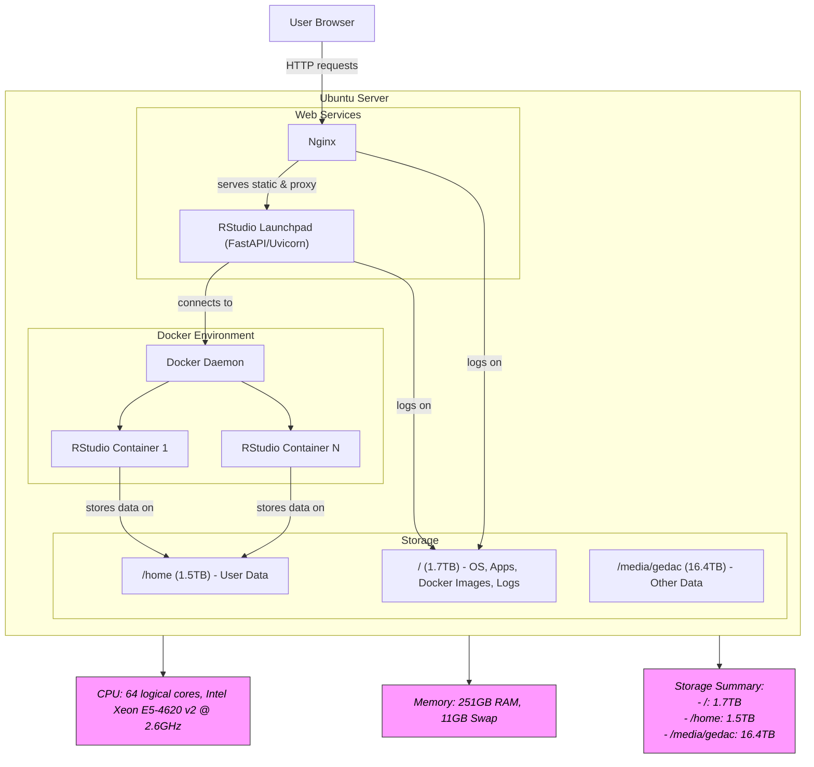

<!-- filepath: /Users/mani/work/rstudio-portal/architecture.md -->

```mermaid
graph TD
 subgraph ubuntu_server["Ubuntu Server<br>251GB RAM, 64 Cores<br>(Intel Xeon E5-4620 v2 @ 2.6GHz)"]

    subgraph web_services["Web Services"]
      nginx["Nginx"]
      launchpad["RStudio Launchpad (FastAPI/Uvicorn)"]
    end

    subgraph docker_env["Docker Environment"]
      docker_daemon["Docker Daemon"]
      rstudio_container_1["RStudio Container 1"]
      rstudio_container_n["RStudio Container N"]
    end

    subgraph storage["Storage"]
      root_fs["/ (1.7TB) - OS, Apps, Docker Images, Logs"]
      home_partition["/home (1.5TB) - User Data"]
      media_gedac["/media/gedac (16.4TB) - Other Data"]
    end

    launchpad -->|connects to| docker_daemon
    docker_daemon --> rstudio_container_1
    docker_daemon --> rstudio_container_n
    rstudio_container_1 -->|stores data on| home_partition
    rstudio_container_n -->|stores data on| home_partition
    launchpad -->|logs on| root_fs
    nginx -->|serves static & proxy| launchpad
    nginx -->|logs on| root_fs
  end

  user_browser["User Browser"]
  user_browser -->|HTTP requests| nginx

  %% Annotations for system resources
  classDef annotation fill:#f9f,stroke:#333,stroke-width:1px,color:#000,font-style:italic;

  note_cpu["CPU: 64 logical cores, Intel Xeon E5-4620 v2 @ 2.6GHz"]:::annotation
  note_mem["Memory: 251GB RAM, 11GB Swap"]:::annotation
  note_storage["Storage Summary:<br>- /: 1.7TB<br>- /home: 1.5TB<br>- /media/gedac: 16.4TB"]:::annotation

  ubuntu_server --> note_cpu
  ubuntu_server --> note_mem
  ubuntu_server --> note_storage
```
